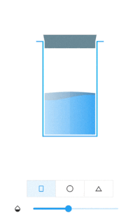
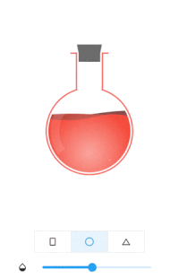
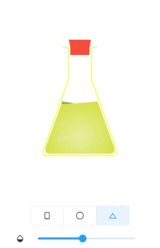

# Water Bottle

A beautiful water bottle for your project.

## Features

This library add a bottle widget to your screen. You can use it as a loading indicator, a progress tracker, or any kind of measurement suits your needs.





## Usage

To use this library, add `water_bottle` as a [https://flutter.dev/docs/development/platform-integration/platform-channels](dependency in your pubspec.yaml) file.

Import it where you need
```dart
import 'package:water_bottle/water_bottle.dart';
```
Build bottle widget
```dart
final plainBottleRef = GlobalKey<WaterBottleState>();
WaterBottle(
    key: plainBottleRef, 
    waterColor: Colors.blue, 
    bottleColor: Colors.lightBlue,
    capColor: Colors.blueGrey
)
```
Update widget
```dart
plainBottleRef.currentState?.waterLevel = 0.5;// 0.0~1.0
```
For more please refer `/example` folder

## Additional information

For more information, or contribution, please refer to the original [https://github.com/hucancode/water_bottle](github)